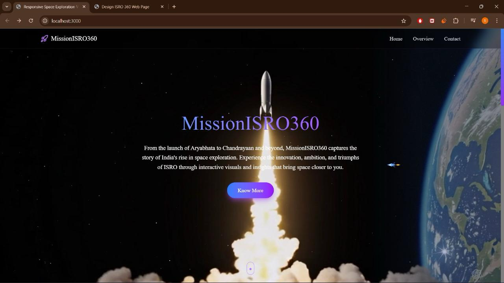
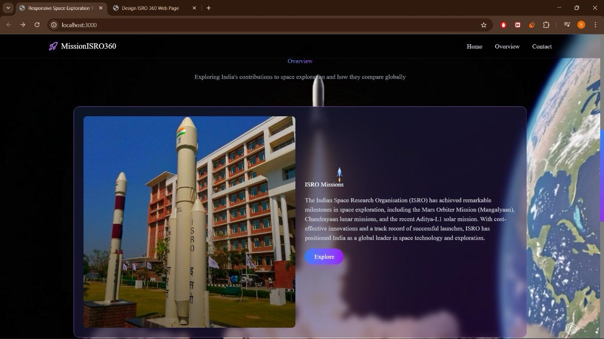
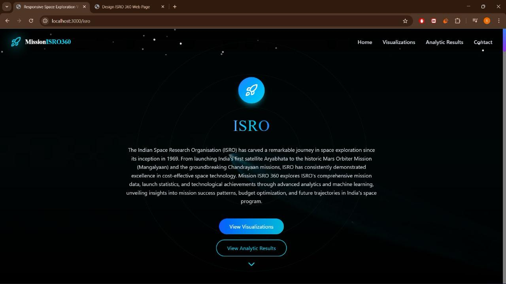
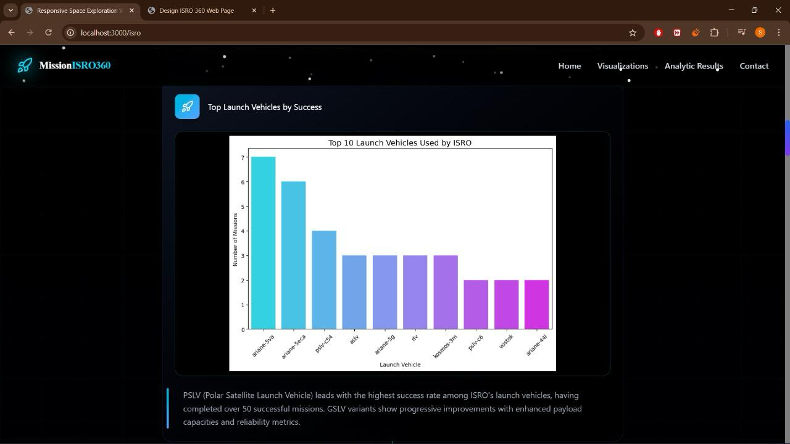
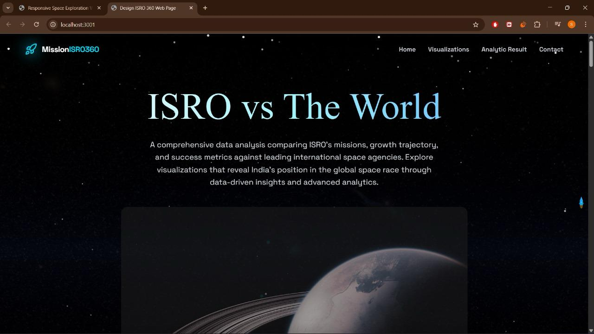
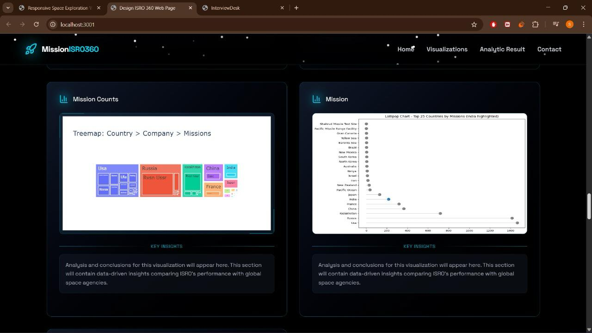

# 🚀 MISSION ISRO 360


### A 360° Data Intelligence Platform for ISRO & Global Space Ecosystem


##  Overview

**MISSION ISRO 360** is a full-stack data-driven platform that presents a **360° analytical view of ISRO in comparison with global space agencies**.

The project combines **React , Node.js (Frontend)** and **Python (Data + ML)** to transform raw space mission datasets into **interactive insights, visual analytics, and comparative intelligence**.

It answers one core question:
 *Where does ISRO stand in the global space race?*


##  Key Highlights

 **360° Perspective** — Compare ISRO with global space agencies
 **Data Visualization** — Interactive graphs and insights
 **ML-Ready Pipeline** — Preprocessed datasets for analysis
 **Multi-page Web App** — Clean UI with structured navigation


##  Website Structure

The platform consists of **three main pages**:

###  Homepage

* Overview of ISRO and global space ecosystem
* Scroll-based UI
* Navigation to analysis sections

###  ISRO Analysis Page

* Focused insights on ISRO missions
* Visualizations from `isro.xlsx` dataset

###  ISRO vs World Page

* Comparative analysis using `full.xlsx` dataset
* Highlights global trends and ISRO’s position


##  Tech Stack

### Frontend

* React.js
* Node.js
* HTML, CSS, JavaScript

### Backend / Data Processing

* Python
* Pandas, NumPy

### Visualization

* Matplotlib / Seaborn

### Dataset

* `isro.xlsx` → ISRO mission dataset
* `full.xlsx` → Global space dataset


##  Project Workflow

```text
Datasets (Excel)
   ↓
Data Cleaning & Preprocessing (Python)
   ↓
Graph Generation & Analysis
   ↓
Processed Data / Visual Output
   ↓
ML model and SHAP analysis
   ↓
React Frontend Integration
   ↓
User Interface 
```


##  Features

*  Mission trend visualization
*  Country-wise space comparison
*  Satellite and launch insights
*  Clean and structured data pipeline
*  Smooth navigation between pages

---

## Screenshots

### Homepage



### ISRO Analysis Page



###  ISRO vs World




##  Future Enhancements

* Live satellite tracking
* Real-time data integration
* Advanced ML models for prediction


##  Author

**Pavithra Sunil kumar**


